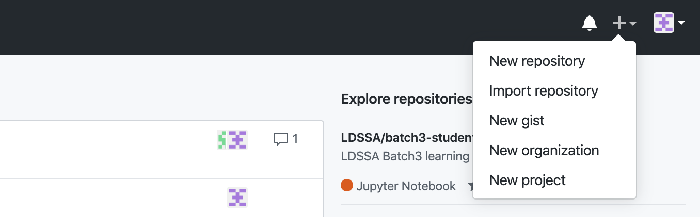
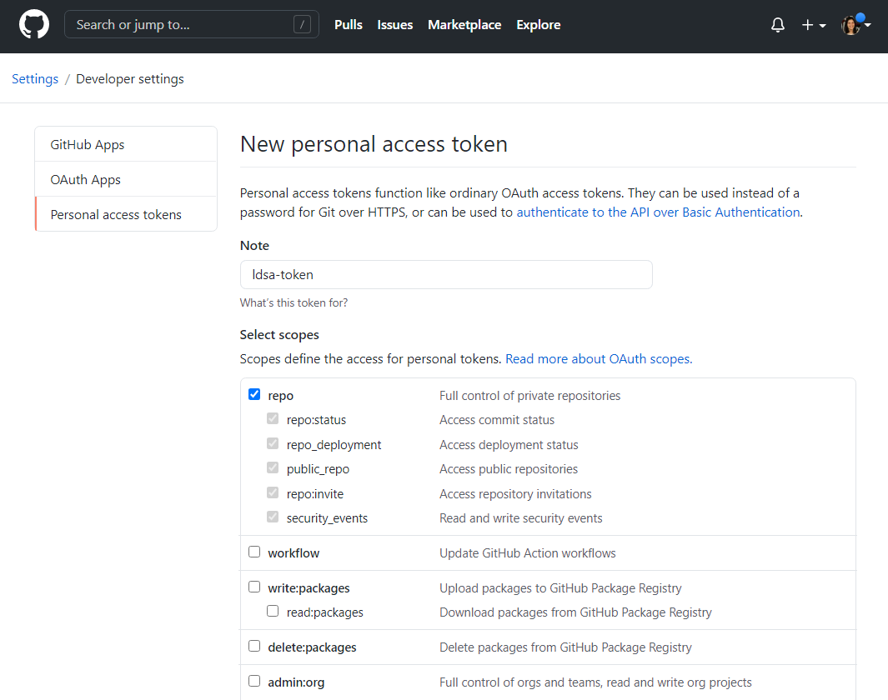
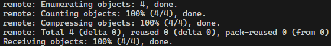
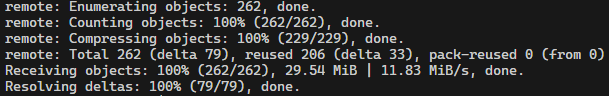

# 3. Setup *Git* and *GitHub*

**'Git'** is a distributed version-control system for tracking changes in source code. A **'repository'** is where code lives, and the code from the prep course will live at [ds-prep-course-2025](https://github.com/LDSSA/ds-prep-course-2025) repository (basically where you are right now, reading this). All the learning materials and exercises will be released (made available) on this repository. You will learn more about **'Git'** in the learning units 3 and 6.

### 3.1 Sign up for GitHub

**Step 1:** [Sign up](https://github.com/join) for a **'GitHub'** account and follow the instructions.

**'GitHub'** is a web-based platform used for version control and collaboration on software development projects providing tools for hosting and managing **'Git'** repositories.

**Step 2:** Open a **'terminal'**. Configure your email, username and name by running the 3 commands below. Replace `mig.dias.1212@gmail.com` below with the **same email you used for creating your GitHub account**, replace `buedaswag` with your **GitHub username**, and replace `Bueda Swag` with your **name**.

```bash
git config --global user.email "mig.dias.1212@gmail.com"
git config --global user.username "buedaswag"
git config --global user.name "Bueda Swag"
```

### 3.2 Setup your workspace repository

The **'workspace directory/repository'** is where you will place everything you are working on, solve exercises, make changes to files, etc.

**Step 1:** Log into **'GitHub'**.

**Step 2:** In the upper-right corner of the page, click the "+" button and select **'New repository'**:

<div style="text-align: center;">
  
</div>

**Step 3:** Create a new **private** repository called `ds-prep-workspace`.

1. You need to explicitly select `Private` - this is your private work environment where nobody else will have access but you.

2. Initialize with a `README`.

3. Add a Python `.gitignore`. This file does exactly what it sounds like - it tells **'Git'** which files to ignore when transferring files between your computer and **'GitHub'**.

<div style="text-align: center;">
  
</div>

You can also check [Creating a new repository](https://help.github.com/en/articles/creating-a-new-repository) on GitHub for help.

**Step 4:** Create your GitHub **Personal Access Token** (**PAT**), often mentioned just as 'token'.

Go to <https://github.com/settings/tokens> and click on **'Generate new token'**. You can give it a name in the note field, such as `ldsa-token`. Then select `repo` in the scopes and click on **'Generate token'**. You will be shown a **'token'** you **should save** - ❗ **IMPORTANT:** **You will not be able to see it again after leaving that window**.

> ⚠️ **Warning:** GitHub **'Personal Access Tokens'** are sequences of characters that begin with `ghp_` which **is also part of the token**

> 📝 **Note:** You can also access the Tokens creation menu manually from the _user menu_ in the top right circular placeholder for your picture $\rightarrow$ _Settings_ $\rightarrow$ _Developer settings_ (last option in the list) $\rightarrow$ _Personal access tokens_ $\rightarrow$ _Tokens (classic)_

<div style="text-align: center;">
  
</div>

### 3.3 Clone your workspace repository

Your **'workspace repository'** now exists on **'GitHub'**, but you also need a local copy (clone) on your computer. You will be working in the **'local workspace repository'** and then transfer your work to your **'remote workspace repository'** on **'GitHub'**.

**Step 1:** Open a terminal (or use one you've already opened).

**Step 2:** You can now **clone** (create a local copy of) the `ds-prep-workspace` repository you created on **'GitHub'**.
Replace `<username>` below with your 'GitHub' username and run the command:

```bash
git clone https://github.com/<username>/ds-prep-workspace.git ~/projects/ds-prep-workspace
```

You'll be asked for your 'GitHub' username. Type it and press <kbd>Enter</kbd>. Then you'll be asked for your git password. Since passwords no longer work for 'GitHub' CLI commands, **you will need to paste your 'personal access token' instead** and press <kbd>Enter</kbd>.

> 📝 **Note**: If you have had a **'GitHub'** account since before this course and you are using **'SSH keys'** instead of **'tokens'**, first make sure that you have completed the steps starting [here](https://docs.github.com/en/authentication/connecting-to-github-with-ssh/checking-for-existing-ssh-keys), then clone your repository like this:
> 
> ```bash
> git clone git@github.com:<username>/ds-prep-workspace.git ~/projects/ds-prep-workspace
> ```
>
> (If you don't know what SSH keys are, just ignore this note.)

> 📝 **Informative section**:  
> (You don't need to run the commands in this _informative section_. They're just here for you to start understanding what's going on with all these `/` symbols.)
>
> So, in case you're wondering, the answer is "yes" :smile:. You could have:
> - created the the `projects` directory yourself with the `mkdir projects` command, where **`mkdir`** stands for '**make directory**';
> - stepped into it with the `cd projects` command, where **`cd`** stands for '**change directory**'.  
>   (also, `cd ..` steps out the current directory)
> - Cloned your repo with a slightly shorter command from within the `projects` directory.
>
> Nonetheless we're tacking a less error-prone approach, so you don't get stuck unnecessarily by accidentally making a wrong move, which by the way, happens all the time when we're just getting started in a new environment.
>
> Don't feel intimidated by these commands. They are simply _**bash**_ - a language to communicate with your operating system.

<span id="cloning-step-3"></span>**Step 3:** 🔎 Verification step 

1. Make sure there are no **errors** nor instances of the word "**fatal**" in the output. A successful cloning process should look something like this:

    

    > 📝 **Note:** Never mind if the numbers you get don't match exactly the ones in this example.

2. If the cloning worked out, you should now have a local copy of your `ds-prep-workspace` repository in your `projects` directory. You can check it's contents as follows:

    ```bash
    ls ~/projects/ds-prep-workspace
    ```

    If the output lists `README.md` and you don't seem to have any errors in the previous cloning process output, **skip step 4 and proceed to section [3.4](#34-clone-the-ds-prep-course-2025-repository)**. Otherwise, try [step 4](#cloning-step-4) (below) for an alternative method of cloning your repo.

    > ⚠️ **Warning:** If you have already tried step 4, and you still haven't been able to clone your repo successfully, **reach out to the [set-up](https://ldsaprepcourse2025.slack.com/archives/C08H3963079) channel on Slack** for additional help.

<span id="cloning-step-4"></span>**Step 4:** Alternative method for cloning your `de-prep-sorkspace` repository

> ⚠️ **Warning:** Perform this step 4 **only if the previous cloning attempt failed**. If both verifications in the previous step 3 were successful, skip this step and proceed to section [3.4](#34-clone-the-ds-prep-course-2025-repository).

Let's start be removing any eventual evidences of the previous cloning attempt.

> ❗ **IMPORTANT: Don't use the following command elsewhere**, unless you know exactly what you're doing, or you're specifically instructed to when asking for help on Slack. It is meant to remove all files and subdirectories (including protected ones) in a specific location, including that location (directory) itself.

> ```bash
> rm -rf ~/projects/ds-prep-workspace
> ```

Now, run the following command, replacing `<username>` and `<personal access token>` below with your **'GitHub'** **username** and **personal access token**, respectively:

> 📝 **Note:** You have to replace `<username>` twice in the command

```bash
git clone https://<username>:<personal access token>@github.com/<username>/ds-prep-workspace.git ~/projects/ds-prep-workspace
``` 

Go back to [step 3](#cloning-step-3)  and perform the verifications again.

### 3.4 Clone the `ds-prep-course-2025` repository

Let's clone the [ds-prep-course-2025](https://github.com/LDSSA/ds-prep-course-2025) repository. This is where all of the learning materials will be made available as the prep course progresses. You will be getting them (pulling) from there.

**Step 1:** Open a **'terminal'** (or use one you've already opened) and clone the Prep Course repository (it's the same that contains the README you're reading right now!):

```bash
git clone https://github.com/LDSSA/ds-prep-course-2025.git ~/projects/ds-prep-course-2025
```

> 📝 **Note:** If you are using **'SSH keys'** for **'GitHub'**, use this command:
> 
> ```bash
> git clone git@github.com:LDSSA/ds-prep-course-2025.git ~/projects/ds-prep-course-2025
> ```
>
> (If you don't know what SSH keys are, just ignore this note.)

**Step 2:** 🔎 Verification step 

1. Make sure there are no **errors** nor instances of the word "**fatal**" in the output. Similarly to the previous example, a successful cloning process should look something like this:

    

    > 📝 **Note:** As previously, never mind if the numbers you get don't match exactly the ones in this example.

2. If the cloning worked out, you should now have a local copy of the content of the LDSA `ds-prep-course-2025` repository inside your `~/projects/ds-prep-course-2025` directory, which you can check as follows:

    ```bash
    ls ~/projects/ds-prep-course-2025
    ```

    If the output lists the following content (whatever the order of the items), you're good to go!

    ```bash
    # output example
    LICENSE   README.md  'Week 00'   docs   media   requirements.txt
    ```

**Step 3:** Copy the `requirements.txt` file from the **'prep course repository'** to your **'local workspace repository'**. The `cp` bash command means **c**o**p**y. Then you have the address of the file that is being copied and to where it is copied.

```bash
cp ~/projects/ds-prep-course-2025/requirements.txt ~/projects/ds-prep-workspace/
```

**Step 4:** 🔎 Verification step 

Check if the copying worked out by listing the contents of the `ds-prep-workspace` directory and **ensuring the `requirements.txt` file is there**.

```bash
ls ~/projects/ds-prep-workspace
```

And you're done with setting **'Git'** and **'GitHub'**! Go back to the main menu and continue with [step 4](../README.md#4-Setup-for-all-operating-systems-python-virtual-environment), setting up your Python virtual environment.
