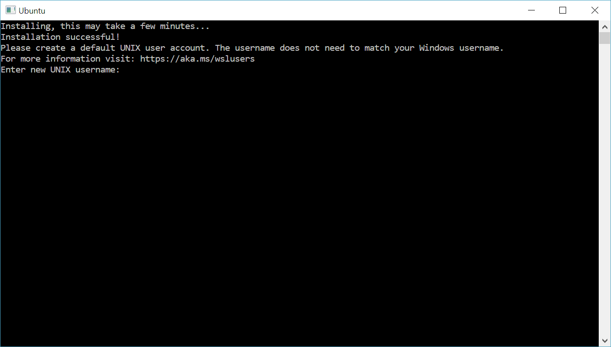
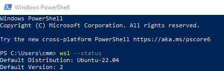

# Windows Subsystem for Linux Installation Guide for Windows 10

## 1. Make sure that Windows is up to date

<span id="step-1_1" style="color: black;">&nbsp; 1.</span> Type `updates` in your **'Windows search bar'** to open the **'Windows search filter'**:


2. Click **'Check for Updates'** in the **'Windows search filter'**:

<div style="text-align: center;">
  
</div>

1. Download and install any updates that appear in the **'Windows Update'** menu (shown below):

<div style="text-align: center;">
  
</div>

After you're done installing those updates, please check which **'OS build'** of Windows 10 you are running using the following steps:

1. Type `about` in your **'Windows search bar'** to open the **'Windows search filter'**.

2. Click **'About your PC (System settings)'**:

<div style="text-align: center;">
  
</div>

1. Check **'OS build'** under **'Windows specifications'**:

<div style="text-align: center;">
  
</div>

1. If your **'OS build'** number is at least `19041.x` proceed to [section 2](#2-install-the-windows-subsystem-for-linux-wsl-2) (_Install the Windows Subsystem for Linux_).
    > The 'x' means any number

2. If your **'OS build'** number is smaller than `19041.x`, then please keep coming back to **'Windows Update'** (previous **[step 1.](#step-1_1)**) and installing updates until you have at least **'OS build'** `19041.x`. Then you may proceed with this guide.

    > 📝 **Note:** For additional details about your system's information see _[Find Information About Your Windows Device](https://support.microsoft.com/en-us/windows/find-information-about-your-windows-device-a66d52c8-3323-44fd-8f34-a9497bb935e1)_.

## 2. Install the Windows Subsystem for Linux (WSL 2)

Before installing any **'GNU/Linux'** or simply **'Linux'** distribution ([as you wish](https://en.wikipedia.org/wiki/GNU/Linux_naming_controversy) [^1]), you must ensure that both **'Windows Subsystem for Linux'** and **'Virtual Machine Platform'** optional Windows features features are enabled.
In this course, we will be using **WSL 2**, the current version of 'Windows subsystem for Linux'.

Following, you have two possible ways of doing this (approaches 1 and 2). Use the one you find more convenient.

> For additional information about **'WSL 2'** check [learn.microsoft.com](https://learn.microsoft.com/en-us/windows/wsl/about) 

### Approach 1: Using the Windows interface

1. Type `turn` in your **'Windows search bar'** to open the **'Windows search filter'**.

2. Click **'Turn Windows features on or off'** in the **'Windows search filter'**:

<div style="text-align: center;">
  
</div>

1. In the **'Windows Features'** menu, activate the required checkboxes, indicated below:

<div style="text-align: center;">
  
</div>

1. Click <kbd>OK</kbd> to finish.

2. Restart your computer if asked to.

### Approach 2: Using the Windows PowerShell

<a id="step-2_2_1" style="color: black;">&nbsp; 1.</a> Open **'PowerShell'** as Administrator by typing `powershell` in your **'Windows search bar'**, and then clicking **'Run as Administrator'** in the **'Windows Search filter'** under **'Windows PowerShell (App)'**

<div style="text-align: center;">
  
</div>

1. Paste the following command in **'PowerShell'**:

```powershell
Enable-WindowsOptionalFeature -Online -FeatureName Microsoft-Windows-Subsystem-Linux,VirtualMachinePlatform
```

<div style="text-align: center;">
  
</div>

1. Run it by pressing <kbd>enter</kbd>.

2. Restart your computer if asked to.

## 3. Install Ubuntu

Open this link to the [Microsoft Store](https://apps.microsoft.com/detail/9nz3klhxdjp5?hl=en-gb&gl=GB) and click **'Download'** to install **'Ubuntu 24.04.x'**.

## 4. Launch Ubuntu

1. Complete the initialization of your newly installed **'Ubuntu'**, launch a new instance. You can either do this by:

   - clicking the **'Open'** or **'Launch'** button in the **'Microsoft Store'** page after the download is finished:

      <div style="text-align: center;">
        
      </div>

    or

   - <span id="open-ubuntu"></span> typing `ubuntu` in the **'Windows search bar'** and clicking **'Ubuntu 24.04.X LTS'** in the **'Windows search filter'**:
      
      📝 This is the method you'll use in the future for opening Ubuntu

      <div style="text-align: center;">
        
      </div>

2. The first time the newly installed **'Ubuntu'** runs, a **'console'** window will open.

      - If you get this error:

        <div style="text-align: center;">
          
        </div>

        Go to [Download the Linux kernel update package](https://learn.microsoft.com/en-us/windows/wsl/install-manual#step-4---download-the-linux-kernel-update-package), download the **'WSL 2 Linux kernel update package for x64 machines'** under **'1. Download the latest package:'** and install it.  
        Then, go back to the **'console'** and press any key to continue. If necessary, launch **'Ubuntu'** again using one of the methods described in step 1.

      - If you don't get the previous error, you're good to go.

You'll now be asked to wait for a minute or two for the installation to complete.

> During this final stage of installation, **'Ubuntu'**'s files are de-compressed and stored on your PC, ready for use. This may take around a minute or more depending on the performance of your PC's storage devices. This initial installation phase is only required on the first launch. All future launches should take less than a second.

## 5. Setting up a new Linux user account

Once the installation is complete, you will be prompted to create a new **'user account'** (and its **'password'**).

<div style="text-align: center;">
  
</div>

This user account is for the normal non-admin user that you'll be logged-in by default when launching **'Ubuntu'**.

> You can choose any **'username'** and **'password'** you wish. They have no bearing on your Windows **'username'**. The only restriction is that the **username** should be in **lowercase**. Beware that when you type passwords in the terminal, you will not see what you are typing. This is a normal behavior in Linux. Just type the **'password'** and hit <kbd>Enter</kbd>.

When you open a new **'Ubuntu'** instance, you won't be prompted for your password, but if you elevate a process using `sudo`, you will need to enter your **'password'**, so make sure you choose a password you can easily remember! On **'Ubuntu'**, every user can do admin tasks such as installing software, but they have to use the magic `sudo` word and input the password. This tells **'Ubuntu'** that you will be acting as admin in the next moments.

> ⚠️ **Important:** Do not forget this **'password'** (along with the associated **'username'**), as you'll not be able to see it again. It is your access card to perform operating system actions that require administrator privileges such as installation of some necessary features to work through the course.

## 6. Checking and setting defaults

**'Ubuntu 24.04'** runs under **'WSL 2'**. Typically, **'Windows'** and **'Ubuntu'** take care of the configuration details for you, but still, **it's recommended to check them anyway**, following these steps:

> ⚠️ This is particularly important if you have **previous versions** of WSL/Ubuntu installed on your computer.

1. Close the **'Ubuntu'** console

2. Open the **'PowerShell'** (if it's not already opened), and run the command:

   ```powershell
   wsl --status
   ```

    > 📝 **Note:** To open the **'PowerShell'** check [step 1.](#step-2_2_1) under _Approach 2: Using the Windows PowerShell_.

   You should get an output similar to:

   <div style="text-align: center;">
     
   </div>

3. Check the first line of the output

   - If `Default Distribution` is `Ubuntu 24.04` move on to the next step (4.)

   - If it's not, run the following command:

     ```powershell
     wsl --set-default Ubuntu-24.04
     ```

4. Check the second line of the output

   - If `Default Version` is `2` you're good to go

   - If it's not, run the following command:

     ```powershell
     wsl --set-default-version 2
     ```

> This procedure will ensure that Windows always runs the appropriated versions of the enabled and installed features.  
> For additional information about **'WSL'** basic commands visit [learn.microsoft.com](https://learn.microsoft.com/en-us/windows/wsl/basic-commands)

> 📝 Informative: If you have more than one OS feature installed, you can run the following command to get the full scope of your system's current features and state:
>
> ```powershell
> wsl -l -v
> ```
>
> , which is the same as running:
>
> ```powershell
> wsl --list --verbose
> ```
>
> Expected output:
>
>   <div style="text-align: center;">
>     
>   </div>

## 7. Opening the WSL terminal

> ⚠️ **Important**: From now on, every time we ask you to open a terminal, this is what you need to do. We'll refer to it just as **'terminal'** instead of 'WSL terminal' or 'Ubuntu terminal'.

1. Whenever you want to use **'WSL'**, just type **'Ubuntu'** in your **'Windows search bar'** and open it in the **'Windows search filter'** (as previously stated):

   <div style="text-align: center;">
     
   </div>

2. Then a **'terminal'** window will open that allows you to interact with **'Ubuntu'**. The beginning of the line shows your Ubuntu username, `cmm` in this example. If you don't see your Ubuntu username, but the line begins with `root`, you forgot to set up the username when installing Ubuntu. The easiest solution is to reinstall Ubuntu.

   <div style="text-align: center;">
     
   </div>

## 8. Enable copy and paste keyboard shortcuts

By default, the **'terminal'** does not allow the usual shortcuts for copying and pasting - you have to enable them first. In the upper left corner of the **'terminal'**, click the orange square, and then click **'Properties'**:

<div style="text-align: center;">
  
</div>

Then under the **'Options'** tab, in the **'Edit Options'** section, make sure that **'Use Ctrl+Shift+C/V as Copy/Paste'** in enabled and click <kbd>OK</kbd>:

<div style="text-align: center;">
  
</div>

## 9. Update & upgrade Ubuntu's software packages

Most Linux distributions ship with an empty/minimal software package catalog. We strongly recommend regularly updating your package catalog, and upgrading your installed packages using the appropriate package manager. On **'Ubuntu'**, you use the `apt` package manager. The following command will check for software updates and install them:

```bash
sudo apt update && sudo apt upgrade
```

> Windows does not automatically update or upgrade your Linux distribution since this is a task that users (specially more experienced ones) usually prefer to control themselves.

## 10. How to use Windows Graphical User Interface (GUI) to access Ubuntu's file system

If you’d like to use your (familiar) operating system built-in tools to manage files and directories in your local repos you can also do so.

> ⚠️ Keep in mind that you should only manipulate files and create/move/remove directories **inside your `/home/<YOUR USERNAME>`** (aka **`~`**) **directory**. The files and directories outside your user directory should be managed by the system itself, unless you know exactly what you're doing...

**Approach 1:**

**Step 1:** In the [terminal](#open-ubuntu), enter your user directory using the `cd` command, replacing `<YOUR USERNAME>` by your actual username:

```bash
cd /home/<YOUR USERNAME>
```

, or simply

```bash
cd ~
```

**Step 2:** Run:

```bash
explorer.exe .
```

> ⚠️ **Don't forget to include the dot at the end of the command!** the **dot** means **"current directory"**, in this case, "open the 'Windows explorer' in the current directory".

Windows Explorer should pop up now:

<div style="text-align: center;">
  
</div>

**Approach 2:**

**Step 1:** Open the '**Windows Explorer**'.

**Step 2:** Directly insert the path (in Windows format) to the prep-course directory (`\\wsl.localhost\Ubuntu-24.04\home\<YOUR USERNAME>`) in the Windows Explorer address bar, replacing `<YOUR USERNAME>` by your actual username:

<div style="text-align: center;">
  
</div>

> 📝 Note that Windows path format is different from the GNU/Linux path format, namely:
> 
> - Starts with `\\wsl.localhost\Ubuntu-24.04\` for accessing Ubuntu
> - The directory tree hierarchical separator is `\`, rather than `/`.

**Approach 3:**

**Single step:** Look for the Linux icon down to the bottom of the '**Windows Explorer Navigation Pane**' (usually docked on left side of the window), under which you're should be able to access Ubuntu directly:

<div style="text-align: center;">
  
</div>

> 📝 If your Navigation Pane is not visible in Windows Explorer, check _View_ $\rarr$ _Navigation Pane_

## 11. Final thoughts

You're all set with **'WSL'**! Never imagined yourself using the wonderful Linux operating system? Don't worry too much about it. First because the LDSA team will be with you all the way, and second, well... Microsoft didn't also, but eventually things change... 😉

<div style="text-align: center;">
  

_[Microsoft's CEO, Jun 2001](https://www.theregister.com/2001/06/02/ballmer_linux_is_a_cancer/)_ [^2]
</div>

<div style="text-align: center;">
  

_[Microsoft (19 contributors), Nov 2023](https://learn.microsoft.com/en-us/windows/wsl/about#microsoft-loves-linux)_ [^3]
</div>

That's it! Time to continue with [step 2](../../WINDOWS.md#step-2) of _Set-up instructions for Windows 10/11_.

### References

[^1]: Various contributors - "**_[GNU/Linux naming controversy](https://en.wikipedia.org/wiki/GNU/Linux_naming_controversy)_**". [Wikipedia](https://www.wikipedia.org/), [2025].  
[^2]: Thomas C Greene - "**_[Ballmer: 'Linux is a cancer'](https://www.theregister.com/2001/06/02/ballmer_linux_is_a_cancer/)_**". [The Register](https://www.theregister.com/), (2001).
[^3]: Various contributors (19) - "**_[What is the Windows Subsystem for Linux?](https://learn.microsoft.com/en-us/windows/wsl/about)_**". [learn.microsoft.com](https://learn.microsoft.com/), (2023).
